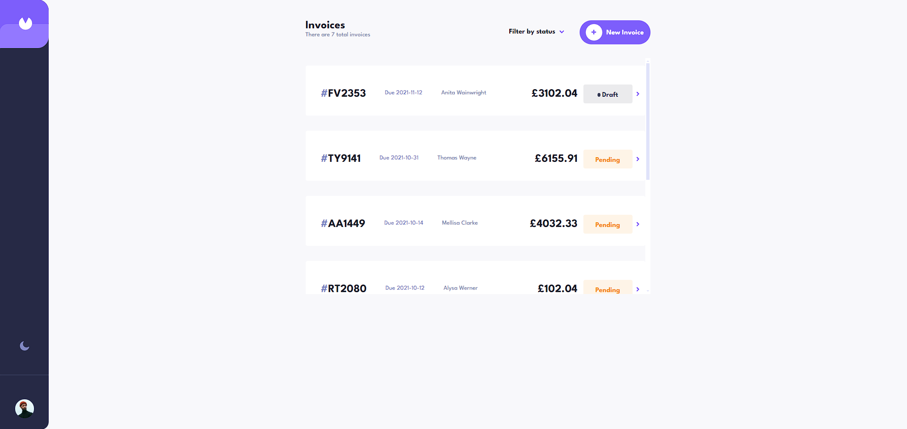
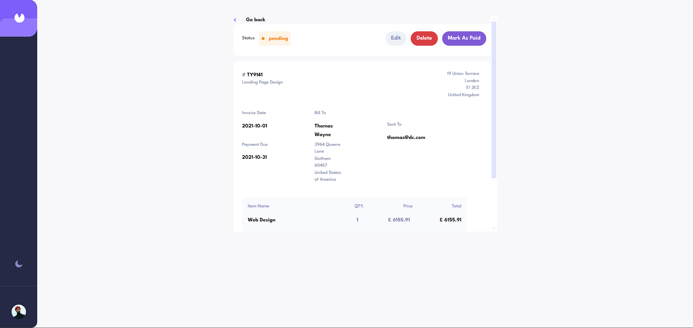

# Frontend Mentor - Invoice app solution

This is a solution to the [Invoice app challenge on Frontend Mentor](https://www.frontendmentor.io/challenges/invoice-app-i7KaLTQjl). Frontend Mentor challenges help you improve your coding skills by building realistic projects.

## Table of contents

- [Overview](#overview)
    - [The challenge](#the-challenge)
    - [Screenshot](#screenshot)
    - [Links](#links)
- [My process](#my-process)
    - [Built with](#built-with)
    - [What I learned](#what-i-learned)
    - [Continued development](#continued-development)
    - [Useful resources](#useful-resources)
- [Author](#author)
- [Acknowledgments](#acknowledgments)

**Note: Delete this note and update the table of contents based on what sections you keep.**

## Overview

### The challenge

Users should be able to:

- View the optimal layout for the app depending on their device's screen size
- See hover states for all interactive elements on the page
- Create, read, update, and delete invoices
- Receive form validations when trying to create/edit an invoice
- Save draft invoices, and mark pending invoices as paid
- Filter invoices by status (draft/pending/paid)
- Toggle light and dark mode
- **Bonus**: Keep track of any changes, even after refreshing the browser (`localStorage` could be used for this if you're not building out a full-stack app)

### Screenshot





### Links

- Solution URL: [https://github.com/ardaocakkk/invoice-app](https://your-solution-url.com)
- Live Site URL: [https://invoice-app-three-eta.vercel.app/](https://your-live-site-url.com)

## My process

### Built with

- CSS custom properties
- Mobile-first workflow
- [React](https://reactjs.org/) - JS library
- [Tailwindcss](https://tailwindcss.com/) - For styles
- [React-Router](https://reactrouter.com/) - For routing
- [Redux](https://redux.js.org/) - For state management
- [formik](https://formik.org/) - For forms


### What I learned


Redux is a state management library that is used to manage the state of a React application. It can be used with any UI library or framework, including React, Angular, Vue, plain JavaScript, and others.


```js
import { createStore } from 'redux';
export const store =  configureStore({
    reducer: {
        invoices: invoiceReducer
    }
});
```


### Useful resources

- [Prototurk Redux](https://www.youtube.com/watch?v=RAR72L8YX_0) - Redux tutorial for beginners. This helped me understand the basics of Redux. I'd recommend it to anyone still learning this concept.


## Author

- Website - [ardaocakk](https://ardaocakkk.github.io/)
- Frontend Mentor - [@ardaocakkk](https://www.frontendmentor.io/profile/ardaocakkk)
- Twitter - [@ardaocak44](https://www.twitter.com/ardaocak44)


